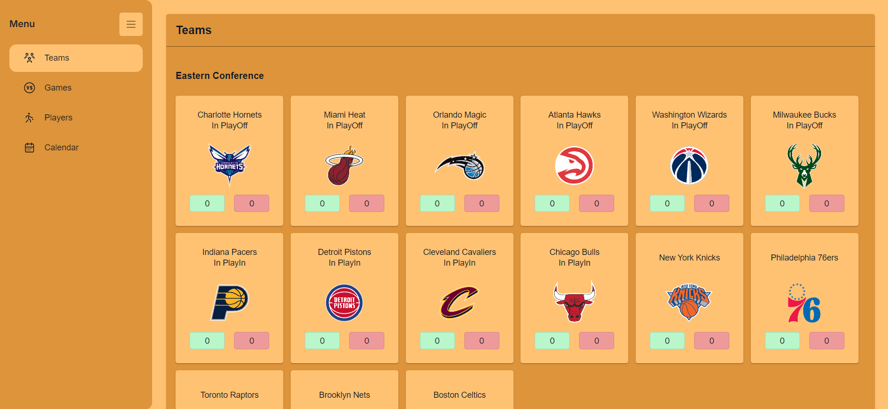

## Data Basketball - Project Frontend

This is a project about basketball with studies purpose using the framework Next js with Typescript, Redux and SASS.

You can clone the repository or, if you want to see it, you can click this [link](https://project-basket-website.vercel.app), where it has been deployed using Vercel platform (check the repository [here](https://github.com/NicoHC185/serverless-vercel-webscraping)), the request maybe take about 1 minute because i'm using a vercel serverless function with a free account 

## Installation and Setup instructions

Clone down this repository. You will need `node` and `npm` installed globally on your machine.

Installation:

`npm install`

To Run Test Suite:

`npm test`

To Start Server:

`npm start`

To Visit App:

`localhost:3000`
